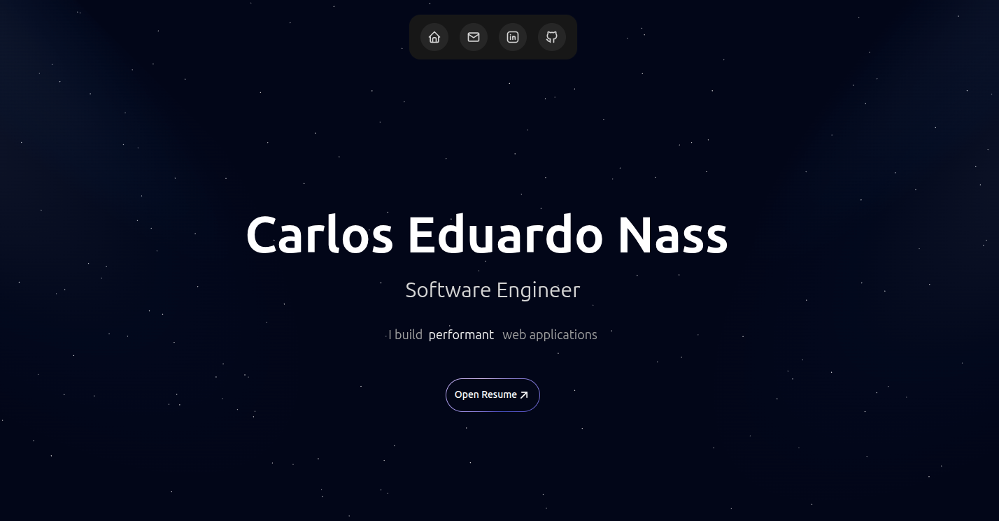

# cadunass - Portfolio Website



A beautiful, responsive, and highly optimized portfolio website built with cutting-edge web technologies. This project showcases professional architecture, comprehensive SEO, type-safe code, and modern design patterns—all ready to deploy as a static site.

## 📋 Table of Contents

- [✨ Features](#-features)
- [📁 Project Structure](#-project-structure)
- [🏗️ Architecture & Design Patterns](#️-architecture--design-patterns)
- [🚀 Getting Started](#-getting-started)
  - [DevContainer Setup (Recommended)](#option-1-devcontainer-recommended-)
  - [Local Installation](#option-2-local-installation)
- [🛠️ Tech Stack](#️-tech-stack)
- [📜 Available Scripts](#-available-scripts)
- [🌐 Deployment](#-deployment)
- [🔧 Performance & Optimization](#-performance--optimization)
- [📝 License](#-license)
- [📧 Contact & Links](#-contact--links)

## ✨ Features

- **⚡ Next.js 15** - Latest App Router with React Server Components and Turbopack
- **📦 Static Export** - Pre-rendered as static HTML for maximum performance
- **🎨 Modern UI** - Beautiful animations with Motion (Framer Motion)
- **🌗 Dark Mode** - Seamless theme switching with next-themes
- **📱 Fully Responsive** - Optimized for all devices and screen sizes
- **🎯 Type-Safe** - Full TypeScript with strict mode enabled
- **🏗️ Clean Architecture** - Modular, scalable, and maintainable codebase
- **♿ Accessible** - WCAG compliant with semantic HTML and ARIA labels
- **🔍 SEO Excellence** - Comprehensive metadata, structured data (JSON-LD), OpenGraph, and Twitter Cards
- **🎭 Component Library** - Custom UI components + Aceternity UI + shadcn/ui integration
- **🐳 DevContainer** - Complete development environment with Docker
- **📊 Google Analytics Ready** - Structured data for enhanced search presence
- **🚀 Performance Optimized** - Font optimization, code splitting, and lazy loading
- **🛠️ Modern Tooling** - Biome for linting and formatting (faster than ESLint + Prettier)

## 📁 Project Structure

```
portfolio/
├── .devcontainer/             # Docker development environment
│   ├── devcontainer.json     # VS Code DevContainer config
│   └── docker-compose.yml    # Docker services configuration
│
├── src/
│   ├── app/                   # Next.js 15 App Router
│   │   ├── layout.tsx        # Root layout + SEO metadata
│   │   ├── page.tsx          # Homepage
│   │   ├── globals.css       # Global styles with Tailwind
│   │   ├── favicon.ico       # Favicons and PWA icons
│   │   ├── icon.svg
│   │   └── apple-icon.png
│   │
│   ├── components/
│   │   ├── sections/         # Major page sections
│   │   │   ├── hero.tsx      # Landing section with animations
│   │   │   ├── about.tsx     # About section
│   │   │   ├── skills.tsx    # Skills showcase
│   │   │   ├── projects.tsx  # Project portfolio
│   │   │   ├── experience.tsx # Work experience timeline
│   │   │   ├── contact.tsx   # Contact form
│   │   │   ├── socials.tsx   # Social links
│   │   │   ├── footer.tsx    # Footer section
│   │   │   └── index.ts      # Centralized exports
│   │   │
│   │   ├── ui/               # Reusable UI components
│   │   │   ├── button.tsx
│   │   │   ├── dropdown-menu.tsx
│   │   │   ├── floating-dock.tsx
│   │   │   ├── floating-navbar.tsx
│   │   │   ├── shooting-stars.tsx
│   │   │   ├── stars-background.tsx
│   │   │   ├── spotlight-new.tsx
│   │   │   ├── typewriter-effect.tsx
│   │   │   ├── timeline.tsx
│   │   │   └── ... (20+ components)
│   │   │
│   │   ├── theme-provider.tsx  # Dark mode context
│   │   ├── theme-toggle.tsx    # Theme switcher
│   │   └── skip-to-content.tsx # Accessibility helper
│   │
│   ├── constants/            # Static data (easy customization)
│   │   ├── personal-info.ts  # Personal details
│   │   ├── skills.ts         # Skills and proficiency
│   │   ├── projects.ts       # Portfolio projects
│   │   ├── experience.ts     # Work history
│   │   ├── social-links.ts   # Social media links
│   │   └── index.ts          # Centralized exports
│   │
│   ├── config/               # Application configuration
│   │   ├── site.ts           # Site-wide settings
│   │   ├── seo.ts            # SEO metadata & structured data
│   │   └── index.ts          # Config exports
│   │
│   ├── hooks/                # Custom React hooks
│   │   └── use-in-view.ts    # Intersection observer hook
│   │
│   ├── types/                # TypeScript definitions
│   │   └── index.ts          # All type interfaces
│   │
│   └── lib/                  # Utility functions
│       └── utils.ts          # Helper functions (cn, etc.)
│
├── public/                   # Static assets
│   ├── resume.pdf           # Downloadable resume
│   ├── og-image.png         # Open Graph image
│   ├── robots.txt           # SEO crawler instructions
│   ├── sitemap.xml          # XML sitemap
│   ├── manifest.json        # PWA manifest
│   └── *.svg                # Vector assets
│
├── out/                     # Static export output (generated)
│
├── Configuration Files
│   ├── package.json         # Dependencies and scripts
│   ├── tsconfig.json        # TypeScript configuration
│   ├── biome.json           # Biome linter/formatter config
│   ├── postcss.config.mjs   # PostCSS with Tailwind 4
│   ├── next.config.ts       # Next.js config (static export)
│   ├── components.json      # shadcn/ui configuration
│   └── pnpm-lock.yaml       # Dependency lock file
│
└── README.md
```

## 🏗️ Architecture & Design Patterns

This project follows professional software engineering practices with a focus on maintainability, scalability, and performance.

### 1. **Separation of Concerns**
- **`/components`** - Pure presentation logic (sections + UI components)
- **`/constants`** - Static data separated from components
- **`/types`** - Centralized TypeScript interfaces
- **`/config`** - Application-wide settings (site config + SEO)
- **`/hooks`** - Custom React hooks for reusable logic
- **`/lib`** - Utility functions and helpers

### 2. **Component Architecture**
- **Sections**: Large, composed page sections (Hero, About, Projects, etc.)
- **UI Components**: Atomic, reusable components (buttons, cards, animations)
- **Layout Components**: Structural components (theme provider, navigation)
- **Composition Pattern**: Build complex UIs from simple, reusable pieces

### 3. **Type Safety First**
- Comprehensive TypeScript interfaces for all data structures
- Strict type checking enabled (`strict: true`)
- No implicit `any` types
- Type-safe props and state management

### 4. **Static Site Generation**
- Pre-rendered at build time for maximum performance
- No server required for deployment
- Deploy anywhere: Vercel, Netlify, GitHub Pages, AWS S3, etc.
- Configured via `output: "export"` in `next.config.ts`

### 5. **SEO & Performance**
- Comprehensive metadata configuration in `src/config/seo.ts`
- JSON-LD structured data (Person, Website schemas)
- OpenGraph and Twitter Card support
- Optimized fonts with `next/font` (Geist, Caveat)
- Automatic sitemap and robots.txt generation

### 6. **Best Practices**
- **Single Responsibility**: Each component/function has one clear purpose
- **DRY Principle**: Data defined once in constants, reused everywhere
- **Composition**: Build from smaller, tested pieces
- **Accessibility**: Semantic HTML, ARIA labels, keyboard navigation
- **Code Quality**: Enforced by Biome (linting + formatting)

## 🚀 Getting Started

You have **two options** for setting up this project: using the pre-configured DevContainer (recommended) or local installation.

### Option 1: DevContainer (Recommended) 🐳

The project includes a complete development environment via DevContainer with **all dependencies pre-installed**. This ensures a consistent development experience across all machines.

**Requirements:**
- Docker Desktop
- Visual Studio Code with the "Dev Containers" extension

**Setup:**
1. **Clone the repository**
   ```bash
   git clone https://github.com/cadunass/portfolio.git
   cd portfolio
   ```

2. **Open in VS Code**
   ```bash
   code .
   ```

3. **Reopen in Container**
   - VS Code will detect the DevContainer configuration
   - Click "Reopen in Container" when prompted
   - Or use Command Palette (F1) → "Dev Containers: Reopen in Container"

4. **Start developing!**
   - The container includes: Node.js, pnpm, and all project extensions
   - Port 3000 is automatically forwarded
   - Run `pnpm dev` to start the development server

**Included Extensions:**
- Biome (linting & formatting)
- Tailwind CSS IntelliSense
- GitLens
- Docker
- GitHub Actions
- And more...

### Option 2: Local Installation

**Prerequisites:**
- Node.js 20+
- pnpm 8+ (recommended) or npm/yarn

**Setup:**

1. **Clone the repository**
   ```bash
   git clone https://github.com/cadunass/portfolio.git
   cd portfolio
   ```

2. **Install dependencies**
   ```bash
   pnpm install
   # or
   npm install
   ```

3. **Run the development server**
   ```bash
   pnpm dev
   ```

4. **Open your browser**
   Navigate to [http://localhost:3000](http://localhost:3000)

### 🏗️ Building for Production

Build the static site:
```bash
pnpm build
```

This generates a static export in the `/out` directory, ready to deploy to any static hosting service.

## 🛠️ Tech Stack

### Core Framework
- **[Next.js 15](https://nextjs.org/)** - React framework with App Router
- **[React 19](https://react.dev/)** - Latest React with RSC support
- **[TypeScript](https://www.typescriptlang.org/)** - Type-safe JavaScript
- **[Turbopack](https://turbo.build/pack)** - Ultra-fast bundler (next-gen Webpack)

### Styling & UI
- **[Tailwind CSS](https://tailwindcss.com/)** - Utility-first CSS framework
- **[PostCSS](https://postcss.org/)** - CSS transformation tool
- **[Aceternity UI](https://ui.aceternity.com)** - Beautiful animated components
- **[shadcn/ui](https://ui.shadcn.com/)** - Re-usable component system
- **[Radix UI](https://www.radix-ui.com/)** - Unstyled, accessible components
- **[CVA](https://cva.style/)** - Class Variance Authority for component variants
- **[tailwind-merge](https://github.com/dcastil/tailwind-merge)** - Smart Tailwind class merging

### Icons & Animations
- **[Tabler Icons](https://tabler-icons.io/)** - 5000+ customizable icons
- **[Lucide React](https://lucide.dev/)** - Beautiful icon set
- **[Motion (Framer Motion)](https://motion.dev/)** - Production-ready animations
- **[tw-animate-css](https://github.com/nerdytim/tw-animate-css)** - Tailwind animation utilities

### Features
- **[next-themes](https://github.com/pacocoursey/next-themes)** - Perfect dark mode
- **[next/font](https://nextjs.org/docs/app/api-reference/components/font)** - Automatic font optimization
- **Static Export** - Pre-rendered HTML for blazing-fast loads

### Developer Experience
- **[Biome](https://biomejs.dev/)** - Fast linter & formatter (replaces ESLint + Prettier)
- **[pnpm](https://pnpm.io/)** - Fast, disk-efficient package manager
- **[DevContainer](https://containers.dev/)** - Consistent dev environment with Docker

## 📜 Available Scripts

```bash
# Development
pnpm dev          # Start dev server with Turbopack (http://localhost:3000)

# Production Build
pnpm build        # Build static site → outputs to /out directory

# Production Preview (optional - requires server)
pnpm start        # Preview production build locally

# Code Quality
pnpm lint         # Run Biome linter and formatter checks
pnpm format       # Auto-format code with Biome

# Package Manager
pnpm install      # Install dependencies
pnpm add <pkg>    # Add new dependency
```

**Note:** This project uses **static export** (`output: "export"`), so `pnpm start` is optional. The build output in `/out` can be served by any static hosting service.

## 🌐 Deployment

This project is configured for **static export** (`output: "export"` in `next.config.ts`), which means it builds to plain HTML/CSS/JS files. You can deploy it **anywhere** that serves static files!

### Quick Deploy Options

#### Option 1: Vercel (Recommended for Next.js)

[](https://vercel.com/new)

1. Push your code to GitHub
2. Import on [Vercel](https://vercel.com)
3. Vercel auto-detects Next.js settings
4. Deploy! 🎉

#### Option 2: GitHub Pages (Free)

```bash
# Build the site
pnpm build

# The /out directory contains your static site
# Push to gh-pages branch or configure in repo settings
```

See [STATIC_EXPORT_GUIDE.md](STATIC_EXPORT_GUIDE.md) for detailed instructions.

#### Option 3: Netlify

1. Connect your GitHub repo
2. Build command: `pnpm build`
3. Publish directory: `out`
4. Deploy! 🎉

#### Option 4: Any Static Host

The `/out` directory after `pnpm build` can be deployed to:
- **AWS S3 + CloudFront**
- **Cloudflare Pages**
- **Netlify**
- **Firebase Hosting**
- **Azure Static Web Apps**
- **DigitalOcean App Platform**
- Any web server (Apache, Nginx, etc.)

### Custom Domain & SSL

Most platforms (Vercel, Netlify, Cloudflare) provide:
- Free SSL certificates
- Custom domain support
- Automatic HTTPS redirects
- CDN distribution

### Environment Considerations

Since this is a static site:
- ✅ No server required
- ✅ Blazing fast load times
- ✅ Excellent SEO
- ✅ Low hosting costs (often free)
- ❌ No server-side API routes (use external APIs if needed)
- ❌ No dynamic server rendering (everything is pre-rendered)

## 🔧 Performance & Optimization

This project is highly optimized for performance and SEO:

### Build Optimizations
- ✅ **Static Site Generation** - Pre-rendered at build time
- ✅ **Turbopack** - Lightning-fast builds (next-gen bundler)
- ✅ **Code Splitting** - Automatic chunk optimization
- ✅ **Tree Shaking** - Removes unused code

### Asset Optimizations
- ✅ **Font Optimization** - `next/font` with display: swap
- ✅ **Image Optimization** - `next/image` with lazy loading
- ✅ **CSS Optimization** - Tailwind CSS purging
- ✅ **Minification** - HTML, CSS, and JS minified

### Runtime Optimizations
- ✅ **React Server Components** - Reduced client-side JS
- ✅ **Lazy Loading** - Components loaded on-demand
- ✅ **Intersection Observer** - Scroll-triggered animations
- ✅ **Efficient Animations** - Hardware-accelerated transforms

### SEO Features
- ✅ **Metadata** - Comprehensive meta tags
- ✅ **Structured Data** - JSON-LD schemas (Person, Website)
- ✅ **OpenGraph Tags** - Social media previews
- ✅ **Sitemap & Robots.txt** - Search engine optimization
- ✅ **Semantic HTML** - Proper heading hierarchy
- ✅ **Mobile-First** - Responsive design

## 📝 License

This project is licensed under the MIT License - see the [LICENSE](LICENSE) file for details.

## 📧 Contact & Links

**cadunass**
- 🌐 Website: [cadunass.com](https://cadunass.com)
- 📧 Email: cadunass0@gmail.com
- 💼 LinkedIn: [Carlos Eduardo Nass](https://www.linkedin.com/in/cadunass/)
- 🐙 GitHub: [@cadunass](https://github.com/cadunass)

---

<p align="center">
  Made with ❤️ by <a href="https://cadunass.com">cadunass</a>
</p>

<p align="center">
  <a href="#-portfolio-website">Back to Top ↑</a>
</p>


